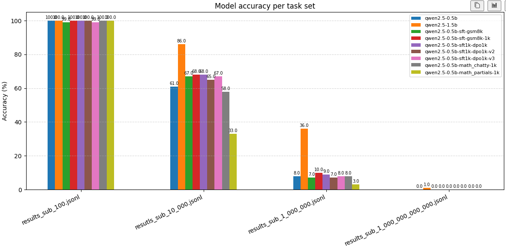

### Dodatkowy task: Qwen models vs multiplications.


#### Dane ewaluacyjne

Przygotowano specjalny zestaw ewaluacyjny zadań opartych o mnożenia dwóch liczb całkowitych. 

Dane zostały zamieszczone pod ścieżką:

```bash
data/mult_taks
├── results_sub_1_000_000_000_000.jsonl
├── results_sub_1_000_000.jsonl
├── results_sub_100.jsonl
└── resutls_sub_10_000.jsonl
```

Każdy zestaw posiada 100 wierszy z zadaniami polegającymi na pomnożeniu dwóch liczb. Trudność zadania w każdym pliku jest ograniczona przez maksymalny wynik mnożenia, który został zawarty jako nazwa pliku. Zatem przykłady łatwę przyjmują postać:

```json
{"question": "Compute 2 * 7.", "answer": "14"}
```

Natomiast skomplikowane:

```json
{"question": "Compute 500193 * 860624.", "answer": "430478100432"}
```

Dane ewaluacyjne zostały wytworzone przez program w języku python z templatkami tekstowymi co gwarantuje ich poprawność.

#### Trening i testy

W ramach laboratorium wytworzono wiele wersji modelu qwen2-0.5b poprzez dostrojenie SFT z PEFT, oraz DPO. Modele były uczone na matematycznych zadaniach opisowych wymagających algebry, logicznego myślenia i rozwiniętej zdolności interpretowania treści zadania. Mimo to, dostrojenie poprawiło zdolności małego modelu 0.5b w pozbawionych długiej treści zadaniach rachunkowych opartych o mnożenie. 




#### Przyczyna poprawy zdolności mnożenia

Douczone modele produkują odpowiedzi w bardziej "konwersacyjnym/rozwlekłym" tonie co wydaje się zwiększać ich porpawność:

```json
{"question": "Compute 88 * 15.", "reference_answer": "1320", "model_output": "Final Answer: 1200"}
```

```json
{"question": "Compute 88 * 15.", "reference_answer": "1320", "model_output": "The calculation is straightforward:\n\n\\[ 88 \\times 15 = 88 \\times (10 + 5) = 88 \\times 10 + 88 \\times 5 = 880 + 440 = 1320 \\]\n\nFinal Answer: 1320"}
```

Warto zauważyć, że konwersacyjność modeli nie zawsze przypomina Chain-of-Thought rozbijające problem na pod-zadania i często nie wprowadza żadnej dodatkowej informacji. Mimo to, sama możliwość wygenerowania większej ilości tokenów lepiej naprowadza model na poprawną odpowiedź. 